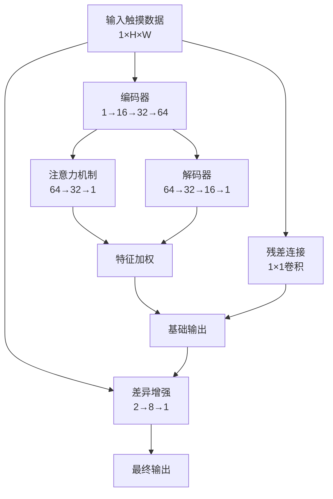
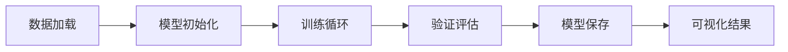

# TouchDataFilter

<div align="center">


**🚀 基于深度学习的触摸数据滤波系统**

## 📖 快速开始

### 💻 安装

```bash
# 克隆项目
git clone https://github.com/ZhuchenZhong/TouchDataFilter.git
cd TouchDataFilter

# 创建虚拟环境
uv venv

# 安装依赖
pip install torch torchvision numpy matplotlib rich

# 自动配置
python init.py
```

### 🚀 使用示例

```python
from core.TouchFilterNet_fp import TouchFilterNet
from core.dataProcessor import TouchDataParser

# 加载模型
model = TouchFilterNet()
model.load_state_dict(torch.load('models/best_model.pth'))

# 处理数据
parser = TouchDataParser('data/input.txt')
header, touch_data = parser.parse()

# 预测滤波
output = model(input_tensor)
```

### 🎮 GUI界面

```bash
python predict.py  # 启动图形化界面
```

## 🎯 模型架构

### 🏗️ 网络结构

TouchFilterNet采用**编码器-解码器架构**，集成多项创新技术：



### 🧮 核心技术

| 技术组件                | 功能描述       | 创新点           |
| ----------------------- | -------------- | ---------------- |
| **编码器-解码器** | 特征提取与重建 | 多层次特征学习   |
| **注意力机制**    | 聚焦重要区域   | 自适应权重分配   |
| **残差连接**      | 信息流保护     | 1×1卷积学习映射 |
| **差异增强**      | 动态特征调整   | 高差异区域增强   |

### 📊 损失函数

**差异保留损失 (DiffPreservingLoss)**:

$$
L_{total} = \beta \cdot L_{MSE} + (1-\beta) \cdot L_{weighted}
$$

其中差异权重为: $w = |y|^{\alpha} + 0.5$

- **α = 1.8**: 高差异区域权重系数
- **β = 0.5**: 损失平衡参数

## 📈 性能表现

### 🎯 精度对比

| 模型类型           | MSE Loss | 推理时间(GPU) | 推理时间(CPU) | 内存占用 |
| ------------------ | -------- | ------------- | ------------- | -------- |
| **浮点模型** | < 0.001  | ~10ms         | ~50ms         | 200MB    |
| **整数模型** | < 0.005  | ~5ms          | ~20ms         | 50MB     |

### 💾 模型规格

| 指标               | 浮点模型          | 整数模型        |
| ------------------ | ----------------- | --------------- |
| **参数量**   | ~50K              | ~50K            |
| **量化位宽** | 32-bit            | 8-bit           |
| **部署场景** | 服务器/高性能设备 | 嵌入式/移动设备 |

## 🛠️ 开发计划

### ✅ 已完成

- [X] 基础编码器-解码器架构
- [X] 注意力机制实现
- [X] 差异保留损失函数
- [X] 浮点模型训练
- [X] 整数模型量化
- [X] GUI预测界面
- [X] 数据可视化工具
- [X] 模型评估指标
- [X] 文档完善

### 🚧 进行中

- [ ] 模型性能优化
  - [ ] 网络结构调优
  - [ ] 超参数搜索
  - [ ] 损失函数改进

## 📂 项目结构

## 📂 项目结构

```
TouchDataFilter/
├── 📁 core/                     # 🧠 核心模块
│   ├── dataProcessor.py         # 📊 数据处理器
│   ├── TouchFilterNet_fp.py     # 🔢 浮点模型
│   └── TouchFilterNet_int.py    # ⚡ 整数模型
├── 📁 data/                     # 💾 数据集
│   ├── 1/, 2/, ..., 10/         # 🔢 多指触摸数据
│   ├── raw/                     # 📄 原始数据
│   └── test/                    # 🧪 测试数据
├── 📁 models/                   # 🤖 训练模型
├── 📁 tools/                    # 🛠️ 辅助工具
│   ├── viewer.py                # 👁️ 数据查看器
│   ├── viewer_tk.py             # 🖼️ GUI查看器
│   └── findTFN_fp_DPL_alpha.py  # 🎯 参数优化
├── 📁 docs/                     # 📚 文档目录
├── 📁 resource/                 # 📦 资源文件
├── train.py                     # 🏋️ 浮点模型训练
├── train_TouchFilterNet_int.py  # ⚡ 整数模型训练
├── predict.py                   # 🔮 GUI预测工具
├── predict-cli.py               # 💻 命令行预测
└── init.py                      # ⚙️ 环境初始化
```

## 🎨 数据格式

### 📄 输入数据结构

```
DATE,2024-01-01
TIME,12:00:00
FW Ver: 1.0.0
TX,32                    # 发送通道数
RX,18                    # 接收通道数
TX_VOLTAGE,5000         # 发送电压
Cf,100                  # 配置参数

Frame[1]:               # 帧数据开始
<32×18触摸数据矩阵>
Frame[2]:
...
```

### 🏗️ 数据结构类

| 类名           | 功能       | 主要字段                             |
| -------------- | ---------- | ------------------------------------ |
| `HeaderInfo` | 文件头信息 | date, time, fw_version, tx, rx       |
| `TouchData`  | 触摸帧数据 | frame_number, timestamp, data_matrix |

## 🏋️ 训练指南

### ⚙️ 训练参数

```python
# 🎯 核心参数
EPOCH = 50                          # 训练轮数
BATCH_SIZE = 32-128                 # 自动调整批次大小
LEARNING_RATE = 1e-3                # 学习率 η = 10^{-3}
OPTIMIZER = Adam                    # Adam优化器
SCHEDULER = ReduceLROnPlateau       # 自适应学习率

# 📊 损失函数参数
ALPHA = 1.8                         # 差异权重系数
BETA = 0.5                          # 损失平衡参数
```

### 🔄 训练流程



### 🚀 启动训练

```bash
# 🔢 浮点模型训练
python train.py

# ⚡ 整数模型训练
python train_TouchFilterNet_int.py

# 📊 参数搜索
python tools/findTFN_fp_DPL_alpha.py --data_dir data/
```

## 🔮 预测与推理

### 🖥️ GUI界面使用

```bash
python predict.py
```

**功能特性:**

- 🎯 模型选择器
- 📁 文件加载器
- 📊 实时数据可视化
- 💾 结果保存功能

### 💻 命令行使用

```bash
python predict-cli.py \
    --model_path models/best_model.pth \
    --input_file data/test_data.txt \
    --output_file results/filtered_data.txt
```

### 🔧 API使用

```python
from core.TouchFilterNet_fp import TouchFilterNet
from core.dataProcessor import TouchDataParser

# 📥 加载模型
model = TouchFilterNet()
model.load_state_dict(torch.load('models/best_model.pth'))
model.eval()

# 📊 处理数据
parser = TouchDataParser('input.txt')
header, frames = parser.parse()

# 🔮 执行预测
with torch.no_grad():
    input_tensor = torch.tensor(frames[0].data_matrix).unsqueeze(0).unsqueeze(0)
    output = model(input_tensor)
```

## 🛠️ 工具箱

### 📊 数据可视化

| 工具                        | 功能             | 使用场景 |
| --------------------------- | ---------------- | -------- |
| `viewer.py`               | Matplotlib查看器 | 数据分析 |
| `viewer_tk.py`            | 交互式GUI        | 实时查看 |
| `findTFN_fp_DPL_alpha.py` | 参数优化         | 调参实验 |

### 🔧 使用示例

```bash
# 📈 可视化数据
python tools/viewer.py --file data/sample.txt

# 🖼️ 交互式查看
python tools/viewer_tk.py

# 🎯 优化参数  
python tools/findTFN_fp_DPL_alpha.py --alpha 1.5 --beta 0.6
```

## ⚙️ 配置文件

### 📝 settings.ini

```ini
[PATHS]
project_root = /path/to/TouchDataFilter
data_root = /path/to/data
model_root = /path/to/models
result_root = /path/to/results

[GPU]
gpu_support = True
batch_size = 47
mixed_precision = True

[TRAINING]
epochs = 50
learning_rate = 1e-3
save_interval = 5
```

### 🤖 自动配置

```bash
python init.py  # 🔍 自动检测环境并生成配置
```

**自动配置功能:**

- ✅ GPU支持检测
- 📊 内存容量分析
- 🎯 最优批次大小计算
- 📁 目录结构创建

## 🤝 贡献指南

欢迎参与项目贡献！请遵循以下步骤：

### 🔄 贡献流程

1. **🍴 Fork项目** → 2. **🌿 创建分支** → 3. **💻 开发功能** → 4. **🧪 测试验证** → 5. **📤 提交PR**

```bash
# 1. Fork并克隆
git clone https://github.com/your-username/TouchDataFilter.git

# 2. 创建特性分支
git checkout -b feature/amazing-feature

# 3. 提交更改
git commit -m "✨ Add amazing feature"

# 4. 推送分支
git push origin feature/amazing-feature

# 5. 创建Pull Request
```

### 📋 贡献指导

- 🐛 **Bug报告**: 使用Issue模板描述问题
- 💡 **功能建议**: 详细说明需求和用例
- 📝 **代码贡献**: 遵循代码风格规范
- 📚 **文档改进**: 完善README和注释

## 📄 许可证

本项目采用 [Mozilla Public License 2.0](LICENSE) 许可证。

## 📞 联系方式

<div align="center">

**👨‍💻 项目维护者**: [ZhuchenZhong](https://github.com/ZhuchenZhong)

[](https://github.com/ZhuchenZhong)
[](https://github.com/ZhuchenZhong/TouchDataFilter)

**🌟 如果这个项目对你有帮助，请给一个Star！**

</div>

---

<div align="center">
  <sub>Built with ❤️ by <a href="https://github.com/ZhuchenZhong">ZhuchenZhong</a></sub>
</div>
